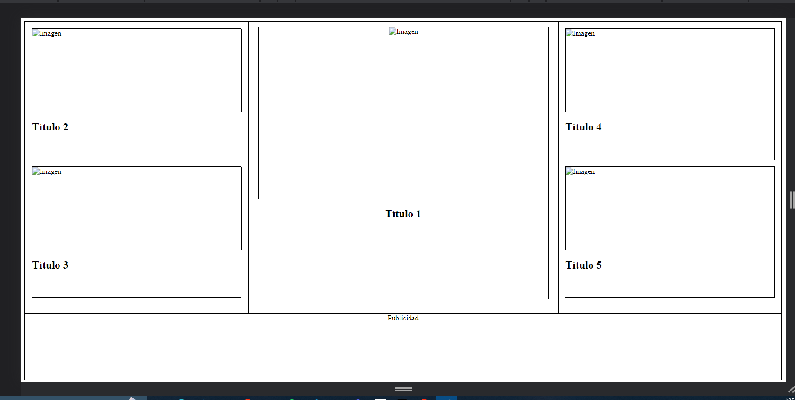
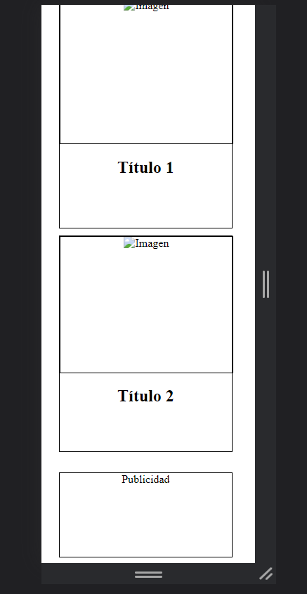

# Maquetado
* Para el maquetado se ha utilizado una estructura de contenedor principal con una serie de elementos hijos. En la versión desktop, el contenedor tiene una estructura en forma de flex con dos columnas y una fila, mientras que en la versión responsive se ha cambiado la estructura a una sola columna.

* Los elementos hijos se dividen en dos bloques de dos artículos y un bloque de un artículo. Cada uno de estos bloques tiene una clase específica que se utiliza para aplicar estilos a través de CSS.

# Estilos
* Para los estilos se ha utilizado una combinación de medidas en pixeles y unidades relativas como rem y em. Se han aplicado bordes y margenes a los elementos para poder visualizar de forma clara cada uno de ellos.

* Además, se ha utilizado una regla de media query para aplicar estilos específicos en pantallas de tamaño móvil. En esta versión se ocultan algunos elementos y se cambia la disposición de otros para adaptarse mejor a la pantalla.

# Llamado a la API
* Para finalizar se llamo la API de rick y morty ya que tiene una buena variedad de imagenes y textos, se hizo uso de SRP donde un servicio controla las peticiones http y ya el componente usa estos servicios para actualización de datos.
